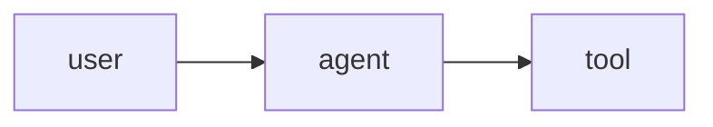

# Pi Inline Viz

> Pi Inline Viz — render structured artifacts such as diagrams, formulas and charts inside Pi terminal UI.

Pi Inline Viz is a [Pi](https://github.com/badlogic/pi-mono) extension that turns explicit artifact blocks into a durable SVG intermediate representation, rasterizes them, and displays them inline in supported terminals. The current release supports D2, Mermaid, and display LaTeX; chart adapters are planned.

## Install

On macOS, install the shared native tools and Mermaid CLI once:

```sh
brew install d2 librsvg
npm install -g @mermaid-js/mermaid-cli@11.16.0
```

Install the stable Pi package from npm:

```sh
pi install npm:pi-inline-viz
```

To test the latest GitHub `main` instead, use `pi install git:github.com/yanyaoer/pi-inline-viz`.

Start Pi, install the self-contained formula renderer, and verify the complete setup:

```text
/inline-viz-install-ratex
/inline-viz-doctor
```

If Pi was already running during installation, run `/reload` once. A healthy doctor report shows D2, LaTeX, Mermaid, and the SVG rasterizer as `READY`.

Linux, custom executable paths, tmux, and terminal-specific setup are covered in [Configuration](docs/configuration.md). Common display problems are covered in [Troubleshooting](docs/troubleshooting.md).

## Try it

Ask Pi to emit an explicit supported block.

### D2

````markdown
```d2
direction: right
user -> agent -> tool
```
````

### Mermaid

````markdown

````

### LaTeX

```markdown
Explain Einstein's mass-energy identity in prose, then render the attention term:

$$
\frac{QK^T}{\sqrt{d}}
$$
```

The Pi integration intentionally renders only display math (`$$...$$`). Inline `$...$` remains prose because a custom transcript entry cannot replace part of an existing Markdown row without duplicating it.

Each image includes an `[open/zoom]` file link. Use the terminal's link gesture, usually Cmd-click on macOS or Ctrl-click on Linux, to open the cached PNG in the configured system image viewer.

## Support matrix

| Artifact | Input | Renderer | Status |
| --- | --- | --- | --- |
| Architecture diagrams | `d2` fence | D2 | Supported |
| Documentation diagrams | `mermaid` fence | Mermaid CLI and Chrome/Chromium | Supported |
| Formulas | `$$...$$` | RaTeX `render-svg` | Supported |
| Charts | Explicit chart block | Future SVG adapter | Planned |

| Terminal | Inline backend | Notes |
| --- | --- | --- |
| Kitty, Ghostty | Kitty graphics with Unicode placeholders | Direct and tmux passthrough |
| iTerm2 | iTerm image protocol | Direct |
| Other terminals | Text/file-link fallback | No unsupported escape sequences |

## Architecture


The image is generated by this project itself. Run `npm run docs:architecture` to rebuild it.

<details>
<summary>D2 source</summary>

```d2
direction: right

input: Pi Assistant Output {
  shape: document
}
integration: Pi Extension
pipeline: Artifact Pipeline {
  direction: down
  adapters: Format Adapters {
    d2: D2
    mermaid: Mermaid
    latex: LaTeX via RaTeX
  }
  svg: SVG IR {
    shape: document
  }
  raster: PNG Asset {
    shape: document
  }
  adapters.d2 -> svg
  adapters.mermaid -> svg
  adapters.latex -> svg
  svg -> raster
}
planner: Asset Planner
terminal: Terminal Backend

input -> integration -> pipeline.adapters
pipeline.raster -> planner -> terminal
```

</details>

The boundaries are deliberately small:

- A format adapter validates source and produces SVG.
- `AssetPlanner` selects a bounded presentation size, scale, format, and background.
- The materializer converts SVG to a cached PNG.
- The terminal backend presents the PNG without knowing its source format.
- The Pi extension detects blocks, appends transcript entries, and exposes setup commands.

SVG and raster identities are separate, so display policy changes can reuse the semantic SVG without rerunning D2, Mermaid, or RaTeX. Backend, transport, and raw viewport dimensions are presentation state and are not part of the cache identity.

## Cache

The default cache is:

```text
~/.cache/pi-inline-viz/
└── <render-key>/
    ├── source.d2 | source.mmd | source.tex
    ├── output.svg
    ├── metadata.json
    └── renders/<asset-key>/
        ├── output.png
        └── metadata.json
```

Set `PI_INLINE_VIZ_CACHE_DIR` to move it. Older `agent-artifact-renderer` and `pi-rich-media` cache locations remain readable only for managed RaTeX compatibility; new artifacts use the new cache.

## Security boundary

Assistant output is untrusted. Pi Inline Viz invokes external tools without a shell, uses isolated temporary working directories and a minimal child environment, applies time and byte limits, rejects D2 imports/icons, restricts Mermaid configuration and external resources, validates generated SVG, and accepts only constrained math rather than full TeX documents.

These controls are defense in depth, not an operating-system sandbox. Installed Pi extensions execute with the user's privileges, and D2, Mermaid CLI, RaTeX, and the SVG rasterizer are local external processes.

## Package layout

```text
extensions/       Pi host entrypoint
src/adapters/     D2, Mermaid, and RaTeX to SVG
src/parser/       Explicit Markdown artifact detection
src/renderer/     Cache, rasterization, and terminal backends
src/              Host-independent artifact contract and planner
scripts/          Doctor, installer, smoke tests, and docs rendering
docs/             Setup and troubleshooting
```

The host-independent API is exported from `pi-inline-viz/core`; `pi-inline-viz` and `pi-inline-viz/pi` export the Pi integration.

## Configuration and maintenance

- [Configuration reference](docs/configuration.md)
- [Troubleshooting](docs/troubleshooting.md)

Update or remove the package with Pi:

```sh
pi update npm:pi-inline-viz
pi remove npm:pi-inline-viz
```

## Development

```sh
npm install
npm run check
npm run test:integration
npm run smoke
npm run smoke:latex
npm run smoke:mermaid
npm run docs:architecture
```

For local Pi testing:

```sh
pi -e ./extensions/pi-inline-viz.ts
```

The real smoke tests execute the external renderer, rasterize an SVG, verify the second render hits both cache layers, and generate the terminal presentation sequence. Golden fixtures pin the D2 and librsvg rendering baseline so dependency drift fails visibly.
