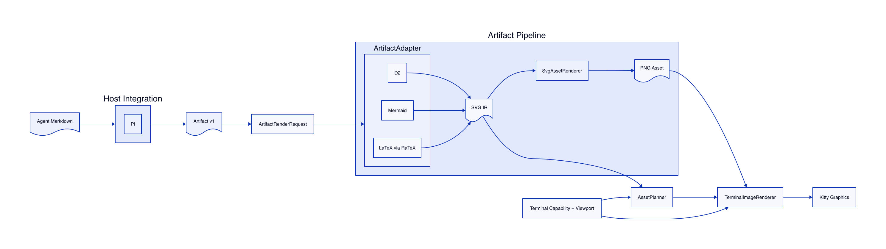
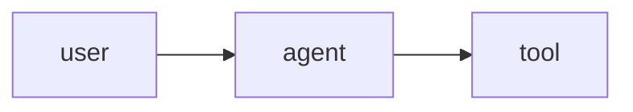

# agent-artifact-renderer

An agent-native artifact rendering engine that turns structured output into a durable SVG IR, then plans, rasterizes, and presents it in a terminal. D2, Mermaid, and constrained LaTeX currently share the same pipeline. Pi is the first host integration, not a core dependency.

## Architecture



The image above is dogfooded through this project's Markdown parser and rendering pipeline. Regenerate it with `npm run docs:architecture`.

<details>
<summary>D2 source</summary>

```d2
direction: right

markdown: Agent Markdown {
  shape: document
}
host: Host Integration {
  pi: Pi
}
artifact: Artifact v1 {
  shape: document
}
request: ArtifactRenderRequest
pipeline: Artifact Pipeline {
  direction: down
  adapter: ArtifactAdapter {
    direction: down
    d2: D2
    mermaid: Mermaid
    latex: LaTeX via RaTeX
  }
  svg: SVG IR {
    shape: document
  }
  asset: AssetRenderer {
    label: SvgAssetRenderer
  }
  png: PNG Asset {
    shape: document
  }

  adapter.d2 -> svg
  adapter.mermaid -> svg
  adapter.latex -> svg
  svg -> asset -> png
}
planner: AssetPlanner
terminal: TerminalRenderer {
  label: TerminalImageRenderer
}
environment: Terminal Capability + Viewport
kitty: Kitty Graphics

markdown -> host -> artifact -> request -> pipeline.adapter
pipeline.svg -> planner
environment -> planner
planner -> terminal
pipeline.png -> terminal
environment -> terminal
terminal -> kitty
```

</details>

The code boundary is intentionally three small interfaces plus one pure planner:

- `ArtifactAdapter`: a structured source block to a durable SVG asset.
- `AssetRenderer`: SVG asset to a backend-compatible raster asset.
- `TerminalRenderer`: raster asset to a terminal UI component.
- `AssetPlanner`: SVG dimensions and display context to a raster or text presentation plan.

The host-independent API is exported from `agent-artifact-renderer/core`. The default export and `agent-artifact-renderer/pi` are the Pi integration. The source tree remains a single package until a second real host proves a package split is useful.

## Artifact contract

Hosts hand the core a deliberately small, versioned semantic artifact:

```ts
interface Artifact {
  version: 1;
  type: "diagram" | "formula" | "chart";
  format: string;
  content: string;
}

interface ArtifactRenderRequest {
  artifact: Artifact;
  options?: RenderOptions;
  policy?: ExecutionPolicy;
}
```

`Artifact` contains no renderer, cache, UI, or arbitrary metadata fields. Parser source positions may coexist on a host-side object, but `artifactIdentity()` selects only the four protocol fields, so comments and transcript metadata cannot fragment the cache. Unsupported protocol versions fail before adapter selection or external process execution.

Omitted request fields resolve to explicit secure defaults. `RenderOptions` is normalized and canonically serialized before identity generation, so property order and explicitly supplied defaults do not change an identity. `ExecutionPolicy` records timeout, byte limits, `network: "deny"`, and `filesystem: "isolated-workdir"`; it constrains execution and is recorded as provenance, but does not claim OS process or network isolation. Adapters still own DSL validation. A shared `Executor` and caller-controlled environment contract are intentionally deferred until they can be enforced rather than merely represented.

The Pi transcript entry contains the media type, renderer ID, asset paths, and compact diagnostics. The display backend is detected when the entry is rendered, so reopening a transcript in another terminal does not preserve a stale capability decision. Content renderers do not control terminal UI rendering, and Kitty does not know how the SVG was produced.

Terminal state is split into two contracts:

- `TerminalCapabilities`: stable backend, transport, Unicode support, and Kitty Unicode-placeholder support.
- `TerminalViewport`: current cell dimensions and optional pixel dimensions.

The separation is deliberate: resizing changes the viewport, not the terminal's capabilities. `AssetPlanner` runs when the transcript entry is displayed and uses the current capability, viewport, and scale policy. Auto scale is deliberately quantized to `1x` or `2x`, bounding raster variants without hashing raw rows, columns, or pixel dimensions. A text-only backend produces a text plan instead of requiring raster bytes.

Pi 0.83 entry renderers are synchronous and receive neither a visibility signal nor a TUI redraw handle. The integration therefore uses turn-boundary materialization: after an assistant turn completes, each detected artifact block is rendered and appended as a ready custom transcript entry. `AssetPlanner` still runs when that entry is displayed, but it never starts asynchronous work from a component's `render()` method. There are no `SIGWINCH` handlers and transcript history is never actively rerendered.

## Requirements

- Node.js 22 or newer
- Pi 0.83 or newer from `@earendil-works/pi-coding-agent` for the Pi integration
- `d2` for D2 blocks
- RaTeX `render-svg`, built with `cli embed-fonts`, for formulas
- Mermaid CLI `mmdc` plus Chrome or Chromium for Mermaid blocks
- `rsvg-convert` (preferred) or ImageMagick's `magick`
- Kitty, Ghostty, WezTerm, iTerm2, or a terminal with a text fallback

On macOS with Homebrew:

```sh
brew install d2 librsvg
```

Install the self-contained formula renderer from the pinned [RaTeX GitHub release](https://github.com/erweixin/RaTeX/releases/tag/v0.1.14):

```sh
npm run install:ratex
```

This explicit command downloads the release for the current OS and architecture, verifies its pinned SHA-256, checks that `render-svg` contains embedded fonts, and installs it under `~/.cache/agent-artifact-renderer/bin`. Normal `npm install` and formula rendering never download executables or require network access. Existing `~/.cache/pi-rich-media/bin/render-svg` installations remain discoverable.

As a development fallback, build it from a RaTeX checkout:

```sh
cargo build --release -p ratex-svg --features "cli embed-fonts"
install -m 0755 target/release/render-svg ~/.local/bin/render-svg
```

The engine searches the explicit `AGENT_ARTIFACT_RATEX_SVG_COMMAND` path first, then its managed cache installation, the legacy Pi cache installation, and finally `render-svg` on `PATH`.

RaTeX also publishes `ratex-wasm` on npm, but that browser package exposes DisplayList and Canvas rendering rather than SVG export. It is not a runtime dependency of this terminal extension.

Install the optional [Mermaid CLI](https://github.com/mermaid-js/mermaid-cli) separately so its Puppeteer and browser footprint does not become a dependency for D2 or LaTeX users:

```sh
npm install -g @mermaid-js/mermaid-cli@11.16.0
```

The adapter auto-detects common Chrome and Chromium executables. Override detection when needed:

```sh
export AGENT_ARTIFACT_CHROME_PATH=/path/to/chrome
```

Mermaid CLI uses headless Chrome internally to produce SVG, but opens no preview or browser window. The adapter records both `mmdc` and Chrome versions in its cache identity.

## Try it

```sh
npm install
pi -e ./src/index.ts
```

Then ask:

```text
show me a d2 architecture diagram: user -> agent -> tool
```

Or render formulas with either supported delimiter form:

```text
Explain the identity $E=mc^2$ and render $$QK^T/\sqrt d$$.
```

Mermaid fences enter the same SVG pipeline:

````markdown

````

The extension tells Pi that fenced D2 is renderable. A completed response such as this is compiled and displayed below the Markdown:

````markdown
```d2
direction: right
user -> agent -> tool
```
````

LaTeX supports inline `$...$` and display `$$...$$` delimiters. Both forms produce separate rich transcript entries at the turn boundary; "inline" describes the accepted Markdown delimiter and RaTeX layout mode, not insertion into the same terminal text row.

To install this checkout as a Pi package:

```sh
pi install /absolute/path/to/agent-artifact-renderer
```

## Rendering details

[Kitty Graphics Protocol](https://sw.kovidgoyal.net/kitty/graphics-protocol/) accepts PNG, RGB, or RGBA pixel data, not SVG. D2 therefore produces the internal SVG IR, `SvgAssetRenderer` rasterizes it, and only then does `TerminalImageRenderer` create the selected terminal sequence.

For formulas, `LatexArtifactAdapter` passes only the validated math expression to RaTeX's self-contained `render-svg` binary. Inline formulas select RaTeX text style; display formulas use display style. The resulting SVG contains outlined glyph paths and enters the same `SvgAssetRenderer` used by D2. Formula PNGs use an explicit white background for predictable contrast across terminal themes; the SVG remains reusable if that policy changes later.

`MermaidArtifactAdapter` invokes `mmdc` with fixed strict-security, text-only label, deterministic-ID, transparent-background, and headless-browser configurations. Source frontmatter, init directives, click handlers, external URLs/styles, HTML resources, images, and icons are rejected. Chrome is routed through an unreachable local proxy, and the returned SVG is rejected if it contains scripts, event handlers, foreign objects, external references, or external stylesheet URLs.

`TerminalImageRenderer` uses Pi TUI's protocol encoders and preserves the component invalidation contract for transcript redraws. Known Kitty Unicode-placeholder terminals (currently Kitty and Ghostty) create a virtual placement (`U=1`) and print `U+10EEEE` placeholder cells for both direct and tmux rendering. Those cells behave as ordinary terminal text: transcript scrolling, line clearing, and differential redraws move or remove the image with them. Pi TUI tracks the transfer's image ID and frees it when the component disappears. This avoids cursor-anchored images drifting over the transcript or footer.

Inside tmux, this extension enables Kitty DCS passthrough only when all of the following are true:

- the outer terminal is known to support Kitty Unicode placeholders (currently Kitty or Ghostty);
- `TMUX` is present; and
- `tmux show-options -gv allow-passthrough` returns `on` or `all`.

Enable it explicitly if desired:

```tmux
set -g allow-passthrough on
```

The tmux placeholder command is prefixed by a quiet query and the real image ID is hidden from Pi TUI's classic-placement tracker. This prevents Pi TUI from emitting an unwrapped Kitty delete command during a redraw, which tmux would otherwise expose as text. WezTerm and Warp remain on the direct classic-placement compatibility path; inside tmux they use the text fallback rather than an unsupported placeholder placement.

If image support is unavailable, the planner selects text presentation and Pi shows a clickable or textual PNG path instead of reading raster bytes or emitting unsupported escape sequences.

`sixel` exists in the capability type so the matrix is explicit, but the current renderer rejects it rather than silently selecting an incompatible protocol.

## Cache

SVG and raster identities are separate so a new DPI or scale can reuse the existing SVG without rerunning the content renderer:

```text
~/.cache/agent-artifact-renderer/
└── <render-key>/
    ├── source.d2 | source.mmd | source.tex
    ├── output.svg
    ├── metadata.json
    └── renders/
        └── <asset-key>/
            ├── output.png
            └── metadata.json
```

Identity is split by the stage that can actually change output:

```text
Artifact identity
  version + type + format + content
                |
                v
SVG render identity
  artifact identity + adapter/version + canonical SVG options
                |
                v
Raster identity
  SVG hash + rasterizer/version + format + DPI + scale + quality + background

Execution provenance
  policy record (not hashed)
```

Today, `theme` is the only adapter-stage option in the SVG render identity. DPI, scale, quality, and background remain raster-stage inputs, so changing them reuses SVG without rerunning D2, Mermaid, or RaTeX. The RaTeX adapter identity includes the complete `render-svg` binary SHA-256, which also covers its embedded KaTeX fonts. Inline and display forms cannot collide even when their formula text is identical. Cache directories are built privately and committed atomically; metadata is written only after all assets pass size validation. Cache hits are rechecked against the current source and execution policy before reuse.

A `PlannedAsset` has the same deterministic key as its compatible materialized raster. Backend, transport, and raw viewport dimensions are intentionally absent, so Kitty, tmux passthrough, and iTerm can share it. SVG bytes, format, rasterizer/version, DPI, quantized scale, quality, and background are present, so changing any renderer ABI input produces a new key. The planner can produce a text plan from the SVG hash and fallback text without a raster policy; the current eager pipeline still requires an installed rasterizer before that entry exists.

Each metadata file records the renderer identity, execution policy, and actual input/output bytes. The policy uses `network: "deny"` and `filesystem: "isolated-workdir"`; these describe enforced extension behavior, not an OS sandbox. Set `AGENT_ARTIFACT_CACHE_DIR` to override the cache root. The former `PI_RICH_MEDIA_CACHE_DIR` name remains a compatibility alias.

## Security limits

Assistant output is untrusted input. The renderer:

- invokes commands without a shell;
- gives child processes a minimal environment and a 15-second timeout;
- caps source at 256 KiB and generated assets at 20 MiB;
- rejects execution policies other than `network: "deny"` and `filesystem: "isolated-workdir"`;
- disables D2 imports, which can read arbitrary `.d2` files;
- disables D2 icons, which can read local paths or fetch URLs;
- fixes Mermaid to strict security and rejects source-controlled configuration, links, remote styles, HTML resources, images, and icons;
- sends headless Chrome traffic to an unreachable local proxy and validates the generated SVG before caching;
- accepts only a fixed whitelist of math commands and rejects full documents, macros, TikZ, file/include, URL, shell, and tokenization primitives;
- requires a self-contained RaTeX binary with embedded fonts;
- verifies the pinned GitHub release archive checksum before installing the managed RaTeX binary; and
- passes formula input to RaTeX without a shell, TeX document wrapper, network fetch, or external include stage.

Renderer security is defense-in-depth. The extension does not provide process or operating-system network isolation. A failed block becomes a durable error entry in the transcript and does not abort the Pi turn.

Override tool paths with `AGENT_ARTIFACT_RATEX_SVG_COMMAND`, `AGENT_ARTIFACT_MERMAID_COMMAND`, and `AGENT_ARTIFACT_CHROME_PATH`.

## Debug mode

Enable durable per-entry rendering diagnostics without writing escape sequences or logs to stdout:

```sh
AGENT_ARTIFACT_DEBUG=1 pi -e ./src/index.ts
```

Each rich transcript entry then includes a compact block like:

```text
[RICH]
block: type=latex-display
asset: svg=11570 bytes png=4098 bytes
cache: content=hit asset=miss
renderer: backend=kitty transport=direct placeholders=yes scale=1
plan: mode=raster format=png size=639x268 scale=1 dpi=96 background=white materializer=rsvg-convert key=e208f8934306
viewport: cells=80x40 pixels=720x720 unicode=yes
```

Diagnostics are displayed lazily with the transcript entry. Debug mode does not add resize listeners or trigger asset generation.

## Next stages

1. Eager turn-boundary materialization: supported by the extension.
2. Async placeholder invalidation: optional future Pi host enhancement, not an extension dependency.
3. Visibility-driven materialization: deferred until the host exposes transcript visibility lifecycle.
4. Next adapters: Graphviz and Vega-Lite through the same SVG pipeline.
5. Split packages only after another host integration requires independent release boundaries.

## Verification

```sh
npm run check
npm run test:integration
npm run install:ratex
npm run smoke
npm run smoke:latex
npm run smoke:mermaid
npm run docs:architecture
```

`npm run smoke` performs a real D2 compile, SVG rasterization, two-layer cache hit, and Kitty sequence generation. `npm run smoke:latex` performs the equivalent real RaTeX formula path. `npm run smoke:mermaid` requires the optional CLI and Chrome, then performs real Mermaid-to-SVG rasterization and a two-layer cache hit. The LaTeX integration suite also exercises the full extension and cache paths against a process-level RaTeX contract fixture; set `PI_RICH_MEDIA_TEST_RATEX_SVG_COMMAND` to add a real binary to that suite. Scripts print JSON result objects and do not write graphics escapes to the invoking terminal.

The integration suite also renders `test/fixtures/architecture.d2` at `1x` and `2x` and compares SHA-256 golden hashes for the SVG and both PNGs. `test/fixtures/expected/toolchain.json` pins D2 and librsvg versions so dependency drift fails visibly instead of silently changing terminal output.
